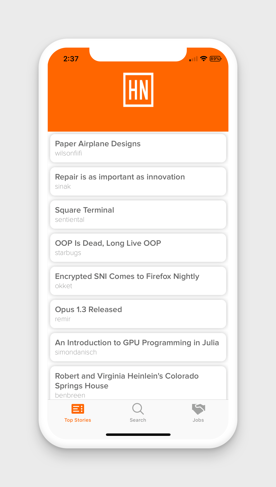

# Hacker-News-Reader

iOS Hacker News Reader app created with [NewsAPI](https://www.newsapi.org "NewsAPI.org")

** Updated RxSwift version with the official [HackerNewsAPI](https://github.com/HackerNews/API)

*available in the app store [here](https://itunes.apple.com/us/app/hacked-news/id1378077153?ls=1&mt=8)*

### Things to Update

- [x] remove blank space below navigation bar
- [x] Add [EmptySet](https://github.com/ZionChang/EmptyKit/ "Empty Set")
- [x] UIRefreshControl
- [x] Redesign with the official [Hacker News API](https://github.com/HackerNews/API "Official Hacker News API")
- [x] [ExpandableTableViewController](https://github.com/enricmacias/ExpandableTableViewController "ExpandableTableViewController") (update included in official API version)
- [x] Update to Swift 4

### Screenshots

